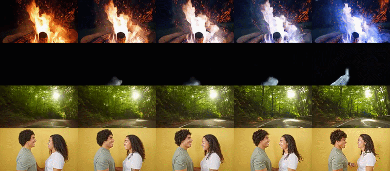
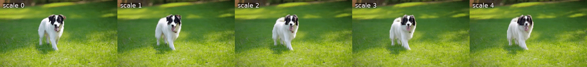
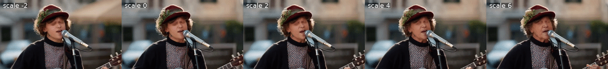
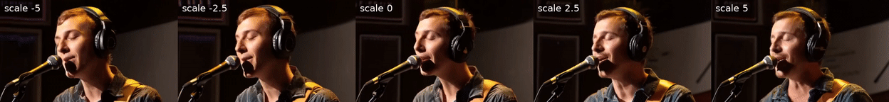
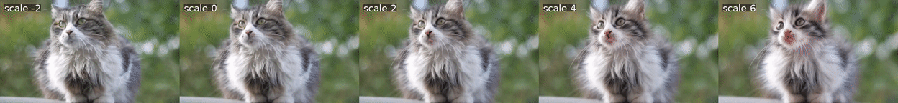

<div align="center">

<h1>TokenDial: Continuous Attribute Control for Text-to-Video Generation in Visual Dial Space</h1>

<b>ACM Transactions on Graphics (SIGGRAPH Asia) 2026</b>

<p>
<a href="https://ariannaliu.github.io/">Zhixuan Liu</a><sup>1,2</sup>,
<a href="https://pschaldenbrand.github.io/">Peter Schaldenbrand</a><sup>2</sup>,
<a href="https://yijunmaverick.github.io/">Yijun Li</a><sup>1</sup>,
<a href="https://mai-t-long.com/">Long Mai</a><sup>1</sup>,
<br>
<a href="https://anime26398.github.io/">Aniruddha Mahapatra</a><sup>1</sup>,
<a href="https://cusuh.github.io/">Cusuh Ham</a><sup>1</sup>,
<a href="https://www.cs.cmu.edu/~jeanoh/">Jean Oh</a><sup>2</sup>,
<a href="https://juiwang.com/">Jui-Hsien Wang</a><sup>1</sup>
<br>
<sup>1</sup>Adobe Research &nbsp;&nbsp; <sup>2</sup>Carnegie Mellon University
</p>

<a href="https://arxiv.org/abs/2603.27520"></a>
<a href="https://tokendial.github.io/"></a>
<!-- <a href="#"></a> -->

</div>

<p align="center">
  
</p>

**TL;DR:** TokenDial turns a frozen text-to-video model into a continuous video editor, giving
slider-style control over appearance and motion while preserving identity and background.

Visual patch tokens in video diffusion transformers keep an explicit correspondence to space and
time. TokenDial treats their channel dimension as a semantic control space, *Visual Dial Space*,
and learns one additive direction per attribute (e.g. age, fur length, motion speed). The generator
stays frozen, and each direction is supervised only through its effect on generated videos, so no
paired edited videos are needed.

## Highlights

- **Pretrained sliders** for [Wan2.1-T2V-1.3B](https://github.com/Wan-Video/Wan2.1). Each one is a single ~180 KB file.
- **Text-to-video slider control**, optionally localized to one subject (e.g. only the dog) by an
  automatically built cross-attention mask.
- **Video-to-video editing** of real videos, inversion-free with [FlowEdit](https://arxiv.org/abs/2412.08629).
- **Training code** for new appearance and motion sliders. The backbone stays frozen, and no paired
  before/after videos are needed.

## Installation

Tested with Python 3.12.

```bash
git clone https://github.com/ariannaliu/TokenDial.git
cd TokenDial

conda create -n tokendial python=3.12 -y
conda activate tokendial

# PyTorch: choose the build that matches your CUDA driver (https://pytorch.org)
pip install torch torchvision --index-url https://download.pytorch.org/whl/cu130

pip install -e .
```

That is all inference needs. The base model, Wan2.1-T2V-1.3B (~17 GB), is downloaded from
Hugging Face into `./models/` on the first run.

**For training**, also install the loss dependencies:

```bash
pip install -e ".[train]"                      # timm, opencv-python, decord, scipy, huggingface_hub
```

Build flash-attn and the two fused kernels that InternVideo2 uses from source (outside the
TokenDial folder; compiling takes a while, lower `MAX_JOBS` if you run out of RAM):

```bash
pip install ninja
git clone https://github.com/Dao-AILab/flash-attention.git
cd flash-attention
MAX_JOBS=8 pip install . --no-build-isolation
cd csrc/fused_dense_lib
pip install -v . --no-build-isolation
cd ../layer_norm
pip install -v . --no-build-isolation
```

Then, back in the TokenDial folder, download the loss models:

```bash
hf auth login                                   # InternVideo2 is gated (see the note below)
python -m tokendial.download_weights            # InternVideo2 -> weights/, DINOv2 -> torch hub cache
```

> [!NOTE]
> InternVideo2 is a gated model. Accept its access conditions on the
> [model page](https://huggingface.co/OpenGVLab/InternVideo2-Stage2_1B-224p-f4) before running
> `download_weights`, and log in with `hf auth login` (or set `HF_TOKEN`). Inference does not need a login.

## Quick Start

### Text-to-video: appearance

```bash
python -m tokendial.inference \
    --ckpt checkpoints/dog_fluffy.safetensors \
    --prompt "A dog walking on the grass." \
    --target_words dog \
    --rgb_cfg_scales "0,1,2,3,4" \
    --output_dir outputs/dog_fluffy
```

This writes one video per scale (`cfg_0.0.mp4` … `cfg_4.0.mp4`) to `outputs/dog_fluffy/`. The scale
is the slider position: `0` is the base model, and larger values give a fluffier coat:

<p align="center">
  
  <br>
  <em>Scales 0 → 4, left to right (<a href="assets/examples/dog_fluffy_sweep.mp4">mp4</a>).</em>
</p>

`--target_words` localizes the edit. A first pass records the cross-attention of these words and
turns it into a spatiotemporal mask, so the rest of the scene stays unchanged. The words must appear
in the prompt. Leave the flag out to apply the slider to the whole frame; the effect is then
stronger, so smaller scales are enough.

Negative scales reverse a slider. The older slider makes the musician younger at `-2` and older at
positive scales. Pass negative values with `=` as below; otherwise argparse reads `-2` as a flag.

```bash
python -m tokendial.inference \
    --ckpt checkpoints/person_older.safetensors \
    --prompt "A street musician sings into a vintage microphone, eyes closed." \
    --target_words musician \
    --rgb_cfg_scales="-2,0,2,4,6" \
    --seed 0 \
    --output_dir outputs/person_older
```

<p align="center">
  
  <br>
  <em>Scales −2 → 6, left to right (<a href="assets/examples/person_older_sweep.mp4">mp4</a>).</em>
</p>

The kitten slider works the same way:

```bash
python -m tokendial.inference --ckpt checkpoints/cat_more_kitten.safetensors \
    --prompt "A cat sitting in a garden, looking at the camera." --target_words cat \
    --rgb_cfg_scales "0,1,2,3,4" --output_dir outputs/cat_more_kitten
```

### Text-to-video: motion

```bash
python -m tokendial.inference --mode motion \
    --ckpt checkpoints/motion.safetensors \
    --prompt "A street musician sings into a vintage microphone, eyes closed." \
    --rgb_cfg_scales="-5,-2.5,0,2.5,5" \
    --num_frames 33 --height 384 --width 672 --seed 2026 \
    --output_dir outputs/motion_example
```

Negative scales speed the motion up and positive scales slow it down. Pass negative values with `=`
as above; otherwise argparse reads `-5` as a flag.

<p align="center">
  
  <br>
  <em>Scales −5 → 5, left to right (<a href="assets/examples/motion_sweep.mp4">mp4</a>).</em>
</p>

### Video-to-video editing

```bash
python -m tokendial.v2v \
    --ckpt checkpoints/cat_more_kitten.safetensors \
    --input_video assets/demo_videos/cat_real.mp4 \
    --prompt "A fluffy gray and white long-haired cat sits on a ledge outdoors, looking around, with a blurred green background." \
    --rgb_cfg_scales="-2,0,2,4,6" \
    --output_dir outputs/v2v_kitten
```

The prompt should describe the input video. It is used as both the source and the target prompt, so
the edit comes only from the slider, and scale `0` reconstructs the input. The whole input video is
edited after resizing to `--height`×`--width` (trimmed to 4n+1 frames if needed); pass `--num_frames N`
to edit only its first N frames. Results are saved as `flowedit_rgb{scale}.mp4`:

<p align="center">
  
  <br>
  <em>Scales −2 → 6, left to right; scale 0 reconstructs the input (<a href="assets/examples/v2v_kitten_sweep.mp4">mp4</a>).</em>
</p>

The other demo video works the same way with the East Asian slider:

```bash
python -m tokendial.v2v --ckpt checkpoints/person_east_asian.safetensors \
    --input_video assets/demo_videos/man_real.mp4 \
    --prompt "A man in a dark suit and tie stands on a city street at dusk, turning his head, blurred bokeh lights in the background." \
    --rgb_cfg_scales "0,1,2,3" --num_frames 61 --output_dir outputs/v2v_east_asian
```

The demo videos are stock footage from Vecteezy:
[Red cat looking around outdoor](https://www.vecteezy.com/video/29214016-red-cat-looking-around-outdoor)
(`cat_real.mp4`) and
[Young Caucasian man in profile, city street bokeh lights](https://www.vecteezy.com/video/72175010-young-caucasian-man-in-profile-city-street-bokeh-lights-contemplative-mood-during-evening-rush-hour-urban-lifestyle-perspective)
(`man_real.mp4`).

<details>
<summary><b>All inference options</b></summary>

| Flag | Default | Description |
|---|---|---|
| `--mode` | `appearance` | T2V only: `appearance` or `motion` (motion sliders take no mask). |
| `--rgb_cfg_scales` | `0,1,2,3` | Comma-separated slider scales; one output video per value. |
| `--seed` | `1` | Shared by all scales, so the videos differ only by the slider. |
| `--num_frames` | `41` (V2V: whole input) | Number of frames; must be 4n+1 (17, 33, 41, 61, 81, …). V2V edits the first N frames of the input. |
| `--height`, `--width` | `480`, `832` | Output resolution (V2V: the input is resized to it). |
| `--negative_prompt` | Wan's default | Negative prompt for classifier-free guidance. |
| `--target_words` | – | Appearance only: words that localize the edit. |
| `--attn_layers` | `13,15,17,21` | DiT layers whose cross-attention builds the mask. |
| `--mask_quantile` | `0.75` | Keep the top 25% of the attention as the mask. |
| `--mask_gamma` | `0.6` | Mask sharpness (<1 broader, >1 tighter). |
| `--save_mask_vis` | off | Save the mask of every latent frame as a PNG. |
| `--n_max` | `40` | V2V only: number of FlowEdit steps (higher = stronger edit). |
| `--output_dir` | `outputs/inference` (V2V: `outputs/v2v`) | Where the videos are written. |

</details>

## Train Your Own Slider

The slider (~180 KB) is the only thing that is trained; Wan2.1 stays frozen.

### 1. Prepare training data

A training set is a folder of video clips plus a metadata file that pairs each clip with a caption.
Real videos are recommended; if you have no suitable footage, generate the clips with the base model
instead (option B).

**Option A: real videos (recommended).** Collect about 100–200 clips of the kind of subject you want
to control (e.g. different people for a person slider) and list them in `metadata.csv`:

```
data/appearance/
├── metadata.csv
└── train/
    ├── clip_0001.mp4
    ├── clip_0002.mp4
    └── ...
```

```csv
video,prompt
clip_0001.mp4,"A man walking on a city street, looking at the camera."
clip_0002.mp4,"An elderly woman reading a book in a park."
```

- `video` is the file name relative to the clip folder (`dataset_base_path`). Common formats such as
  `.mp4`, `.mov`, `.mkv` and `.webm` work.
- `prompt` is a one-sentence caption of the clip; it is the text condition during training.
- Training reads the first `num_frames` frames of each clip (17 for appearance, 33 for motion, set in
  the YAML) and resizes and center-crops them to the recipe resolution. Shorter clips are used whole,
  cut to 4n+1 frames.
- `metadata.json` or `metadata.jsonl` with the same keys also work.

These paths are the defaults in `configs/appearance.yaml` (`data/motion/` in `configs/motion.yaml`).
To use other locations, pass `--dataset_base_path` and `--dataset_metadata_path`.

**Option B: generated videos.** Write one prompt per line in `prompts.txt` and let the base model
generate the clips:

```bash
python -m tokendial.datagen --prompts_txt prompts.txt \
    --output_train_dir data/appearance/train --metadata_root data/appearance
python -m tokendial.datagen --merge_only --metadata_root data/appearance
```

This writes the clips and `data/appearance/metadata.csv` in the same format. To generate on several
GPUs, start one process per GPU with `--worker_id i --num_workers N`, then merge with
`--merge_only --num_workers N`.

**Motion sliders** are trained on real green-screen clips with Option A: people doing everyday actions
in front of a plain green background, so that the measured motion comes from the subject rather than
the background or the camera. Example captions:

```csv
video,prompt
clip_0001.mp4,A person waving hello with one hand on green screen.
clip_0002.mp4,A man clapping hands repeatedly on green screen.
clip_0003.mp4,A woman drinking water from a clear bottle on green screen background.
```

### 2. Define the direction (appearance sliders)

What an appearance slider does is set by a small JSON file, not by code. The edit direction is
`mean(direction_prompts) − mean(neg_direction_prompts)`, computed with InternVideo2's text encoder:

```json
{
  "direction_prompts":     ["a baby kitten", "a very young cat", "a newborn cat"],
  "neg_direction_prompts": ["a very old cat", "an elderly cat"]
}
```

- Use a few short phrases on each side that differ only in the attribute, and name the same kind of
  subject as your training clips. Positive scales move toward `direction_prompts`; negative scales
  push the other way.
- `orthogonal_anchor_pairs` (optional) keeps correlated attributes fixed: the direction of each prompt
  pair is projected out of the edit direction. For example,
  [`person_older.json`](configs/directions/person_older.json) keeps "older" from also making the
  person heavier with pairs such as `["heavy person", "thin person"]`.
- `base_prompts`, which appears in the provided files, is not used by the loss and can be omitted.

The directions of the pretrained sliders are in [`configs/directions/`](configs/directions). Motion
sliders need no direction file.

### 3. Train

```bash
# Appearance slider
accelerate launch --num_processes 1 -m tokendial.train --config configs/appearance.yaml \
    --direction configs/directions/person_older.json

# Motion slider
accelerate launch --num_processes 1 -m tokendial.train --config configs/motion.yaml
```

`tokendial/train_appearance.sh` and `tokendial/train_motion.sh` are single-GPU shortcuts for the same
commands. Every epoch saves `epoch-<n>.safetensors` (only the slider, ~180 KB) to `output_path`, which is
`runs/appearance/my_slider` or `runs/motion/my_slider` by default. Try the last one right away:

```bash
python -m tokendial.inference --ckpt runs/appearance/my_slider/epoch-1.safetensors \
    --prompt "A man walking on a city street, looking at the camera." --target_words man \
    --rgb_cfg_scales "0,2,4"
```

Hyperparameters live in the YAML recipes, and any of them can be overridden on the command line,
e.g. `--output_path runs/older --num_epochs 3` (see the table below).

**Hardware.** With the default recipes, training peaks at about 84 GB (appearance) and 91 GB
(motion) of GPU memory, so it needs a 96 GB GPU such as the NVIDIA RTX PRO 6000, and a run has `#clips × dataset_repeat × num_epochs`
steps. To train appearance sliders on an 80 GB GPU, pass `--num_frames 9`; we tested this on an
NVIDIA H100, where training peaks at about 58 GB. 

> [!TIP]
> The recipes assume a single GPU. With `accelerate launch --multi_gpu --num_processes N ...`, every
> epoch has N× fewer optimizer steps, so multiply `num_epochs` by N (or raise the learning rate) to
> match. Otherwise the slider ends up under-trained.

> [!NOTE]
> - With the default recipe, motion clips need at least 33 frames: the motion loss measures movement
>   over the first `dino.num_keyframes` (32) frames, and shorter clips give no training signal. For
>   shorter clips, lower `num_frames` and `dino.num_keyframes` together in `configs/motion.yaml`,
>   keeping `num_keyframes` ≤ `num_frames` (e.g. 17 and 16).
> - Training resumes from the newest checkpoint in `output_path`. Pass a new `--output_path` to start
>   from scratch.

<details>
<summary><b>Main hyperparameters</b></summary>

| Field | Appearance | Motion | Meaning |
|---|---|---|---|
| `learning_rate` | `5e-4` | `1e-4` | AdamW learning rate. |
| `num_epochs` | `5` | `2` | Passes over the data; one checkpoint per epoch. |
| `dataset_repeat` | `2` | `1` | Times each clip is seen per epoch. |
| `height`, `width`, `num_frames` | `480`, `832`, `17` | `384`, `672`, `33` | Training resolution and clip length. |
| `internvideo.loss_weight` | `1.0` | – | Weight of the appearance loss. |
| `internvideo.guidance_method` | `text` | – | `text` (prompts) or `video` (example videos, see below). |
| `dino.num_keyframes`, `dino.stride` | – | `32`, `1` | Frames used to measure motion. |
| `dino.fast_ratio` | – | `0.5` | Target motion relative to the current motion; below 1 the slider learns to slow down. (Recommended setting) |
| `dino.firstframe_reg_weight` | – | `0.03` | Optional first-frame identity regularizer. |

- To define a direction with example videos instead of prompts, set `internvideo.guidance_method: video`
  and list `video_dir`, `pos_videos` and `neg_videos` in the JSON.
- The InternVideo2 architecture is set in `feature_losses/internvideo2/demo/internvideo2_stage2_config.py`
  and normally needs no changes.

</details>

## How It Works

- **A slider is one direction in Visual Dial Space.** It is stored as `rgb_token`: one 1536-d vector
  for each of the 30 DiT blocks, added to the block's self-attention output for every visual token
  (`attn_out += rgb_token[layer]`) before the gated residual. Nothing else in Wan2.1 changes.
- **Slider guidance.** At inference the offset gets its own guidance term,
  `pred = null + cfg·(text − null) + s·(text_with_token − text_without_token)`,
  so the scale `s` (`--rgb_cfg_scales`) is a smooth, signed dial that can also extrapolate and reverse.
  A nonzero scale costs one extra DiT pass per denoising step.
- **Supervision.** During training, the token-on and token-off x0 predictions at a random timestep
  are decoded to pixels and compared:

  | Slider | Loss | Objective |
  |---|---|---|
  | appearance | InternVideo2 feature loss | Make the change in InternVideo2 video features point along the direction from the JSON (cosine loss). |
  | motion | DINOv2 feature-flow loss | Pull the DINOv2 feature flow of the token-on video toward a `fast_ratio`-scaled copy of itself, so positive scales slow motion down. The offset is not applied to the first latent frame, which anchors identity. |

- **Localization.** With `--target_words`, a first pass (token off) builds a soft spatiotemporal
  mask from the cross-attention of those words, and the offset is multiplied by it.
- **Video-to-video.** FlowEdit uses the same prompt for source and target, so the edit comes only
  from the slider term.

The method code is in `diffsynth/models/wan_video_dit.py` (offset injection),
`diffsynth/pipelines/wan_video.py` (slider guidance and masking), `diffsynth/diffusion/loss.py`
(training objectives) and `feature_losses/` (InternVideo2 and DINOv2 losses).

## Acknowledgements

Built on [DiffSynth-Studio](https://github.com/modelscope/DiffSynth-Studio) and
[Wan2.1](https://github.com/Wan-Video/Wan2.1). Training uses
[InternVideo2](https://github.com/OpenGVLab/InternVideo) and
[DINOv2](https://github.com/facebookresearch/dinov2). Video-to-video editing adapts
[FlowEdit](https://arxiv.org/abs/2412.08629) (Kulikov et al., ICCV 2025). The video-to-video demo videos
are from [Vecteezy](https://www.vecteezy.com) (sources listed under
[Video-to-video editing](#video-to-video-editing)). See [`NOTICE`](NOTICE) for details.

## Citation

If you find this project helpful, please consider citing our work:

```bibtex
@misc{liu2026tokendialcontinuousattributecontrol,
  title={TokenDial: Continuous Attribute Control for Text-to-Video Generation in Visual Dial Space},
  author={Zhixuan Liu and Peter Schaldenbrand and Yijun Li and Long Mai and Aniruddha Mahapatra and Cusuh Ham and Jean Oh and Jui-Hsien Wang},
  year={2026},
  eprint={2603.27520},
  archivePrefix={arXiv},
  primaryClass={cs.CV},
  url={https://arxiv.org/abs/2603.27520},
}
```

## License

Apache-2.0 (see [`LICENSE`](LICENSE)). Vendored components and the demo videos keep their original
licenses (see [`NOTICE`](NOTICE)).
